<div align="center">

# HelpMore

**Платформа поиска и размещения услуг для студентов, выпускников и сотрудников ИТМО**

Микросервисное веб-приложение с авторизацией через Yandex ID, чатом,
отзывами, мультиязычным интерфейсом и админ-панелью модерации.

</div>

---

## О проекте

**HelpMore** — это маркетплейс услуг внутри сообщества ИТМО. Пользователи входят
через **Yandex ID**, размещают и находят услуги, общаются в чате, оставляют отзывы
и жалуются на нарушения. Администраторы управляют пользователями и услугами через
отдельную панель модерации.

Интерфейс переведён на **три языка**: русский, английский и китайский.

## Возможности

- 🔐 **Авторизация через Yandex ID** (OAuth 2.0)
- 🛠️ **Каталог услуг** — размещение, поиск и просмотр услуг
- 💬 **Чат** между заказчиком и исполнителем
- ⭐ **Отзывы и рейтинги**
- 👤 **Личный профиль** пользователя
- 🌍 **Мультиязычность** — 🇷🇺 русский, 🇬🇧 английский, 🇨🇳 китайский
- 🛡️ **Админ-панель** — управление пользователями, услугами, обработка жалоб и багрепортов

## Технологический стек

| Слой | Технологии |
| --- | --- |
| **Frontend** | React 18, TypeScript, Vite 6, Tailwind CSS, Radix UI, axios |
| **API Gateway** | Go 1.24 |
| **Communication Service** | Go 1.24 |
| **User Service** | Java 21, Spring Boot, Gradle |
| **Management Service** | Java 21, Spring Boot, Gradle |
| **База данных** | PostgreSQL 16 |
| **Инфраструктура** | Docker, Docker Compose |

## Архитектура

```
                         ┌─────────────┐
                         │   Frontend  │  :5173
                         │  React/Vite │
                         └──────┬──────┘
                                │
                         ┌──────▼──────┐
                         │ API Gateway │  :8000  (Go)
                         └──────┬──────┘
              ┌─────────────────┼──────────────────┐
              │                 │                   │
      ┌───────▼──────┐  ┌───────▼───────┐  ┌────────▼────────┐
      │ User Service │  │  Management   │  │ Communication   │
      │  :8282 (Java)│  │ Service :8181 │  │  Service :8002  │
      │              │  │    (Java)     │  │      (Go)       │
      └───────┬──────┘  └───────┬───────┘  └────────┬────────┘
              └─────────────────┼───────────────────┘
                         ┌──────▼──────┐
                         │ PostgreSQL  │  :5432
                         └─────────────┘
```

| Сервис | Порт | Назначение |
| --- | --- | --- |
| `frontend` | `5173` | Веб-интерфейс |
| `api-gateway` | `8000` | Единая точка входа, маршрутизация и авторизация |
| `communication-service` | `8002` | Чат и обмен сообщениями |
| `user-service` | `8282` | Пользователи, профили, авторизация через Yandex |
| `management-service` | `8181` | Модерация: услуги, жалобы, багрепорты |
| `postgres` | `5432` | Хранение данных |


> **Примечание.** Для входа через Yandex ID у аккаунта должна быть привязана


## Скриншоты

### Вход через Yandex ID
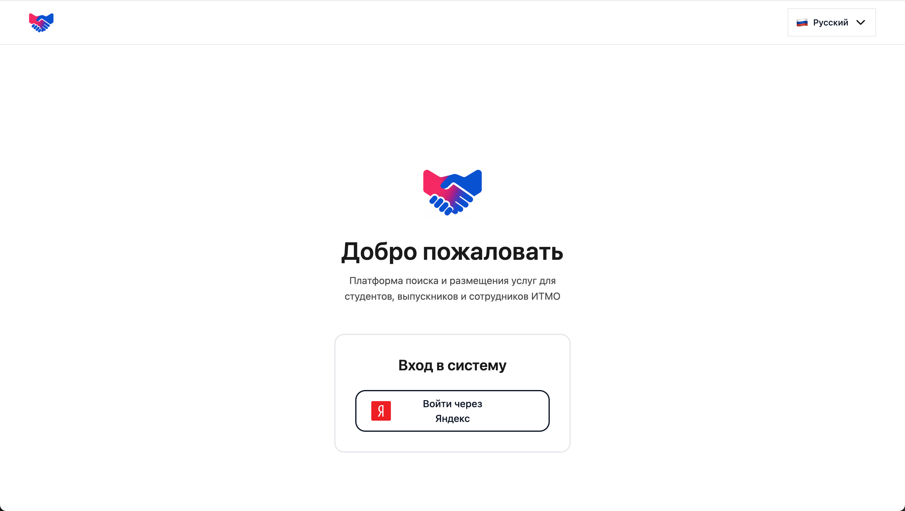

### Главная страница
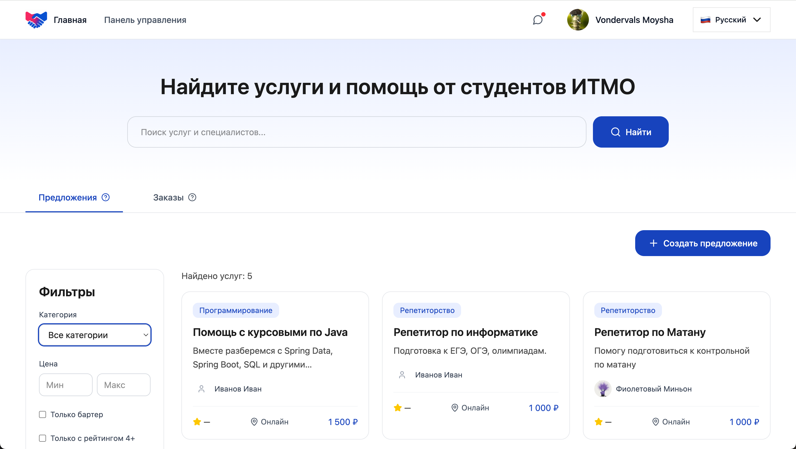

### Выбор услуги
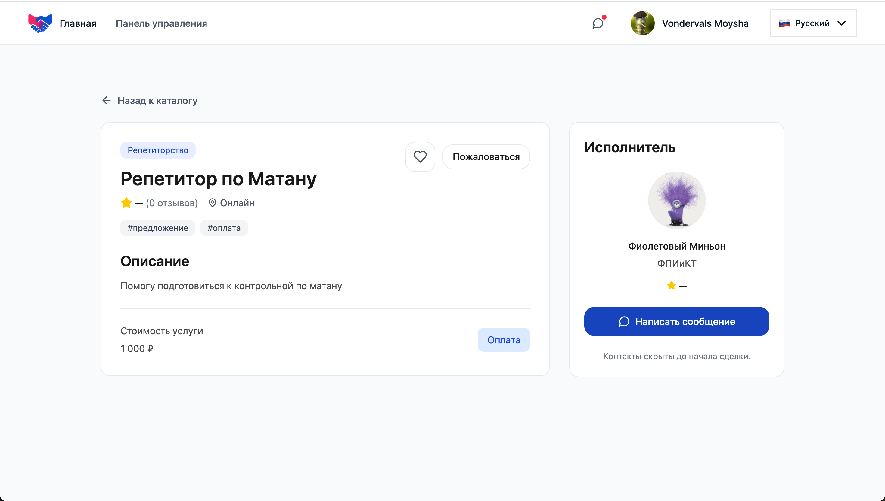

### Чат
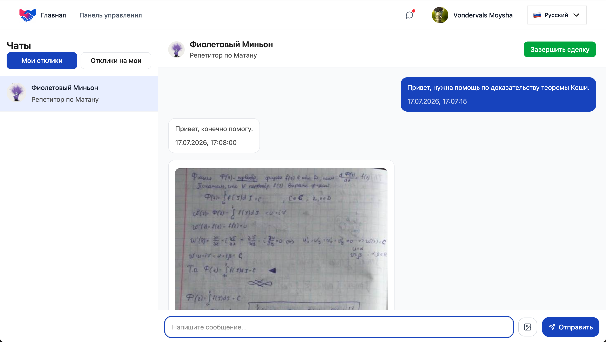

### Отзыв
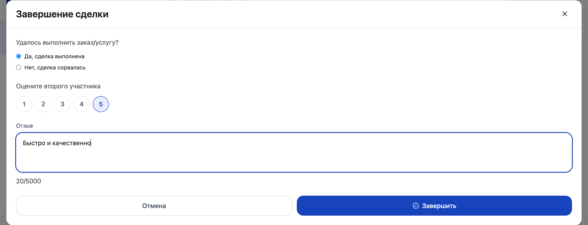

### Профиль
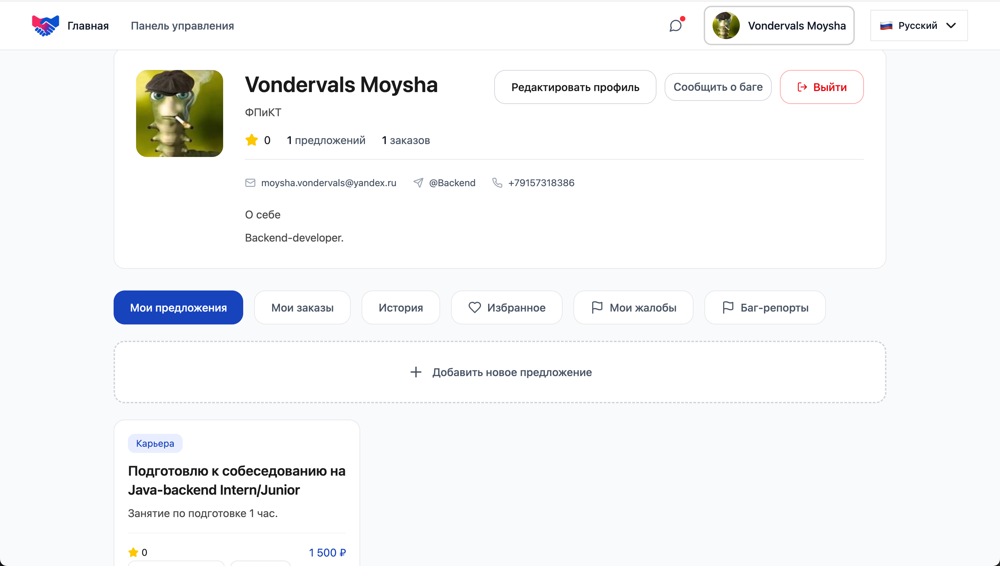

### Мультиязычность

Английский:
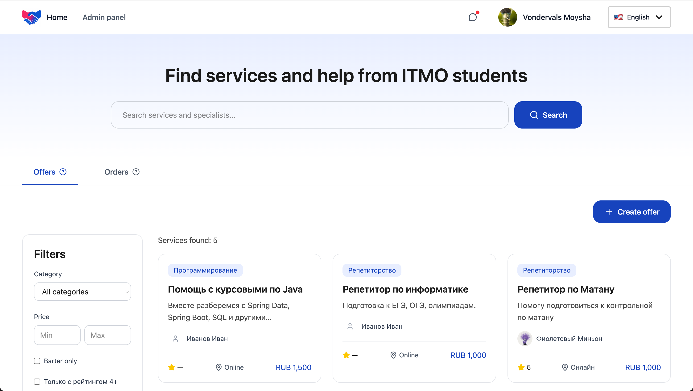

Китайский:
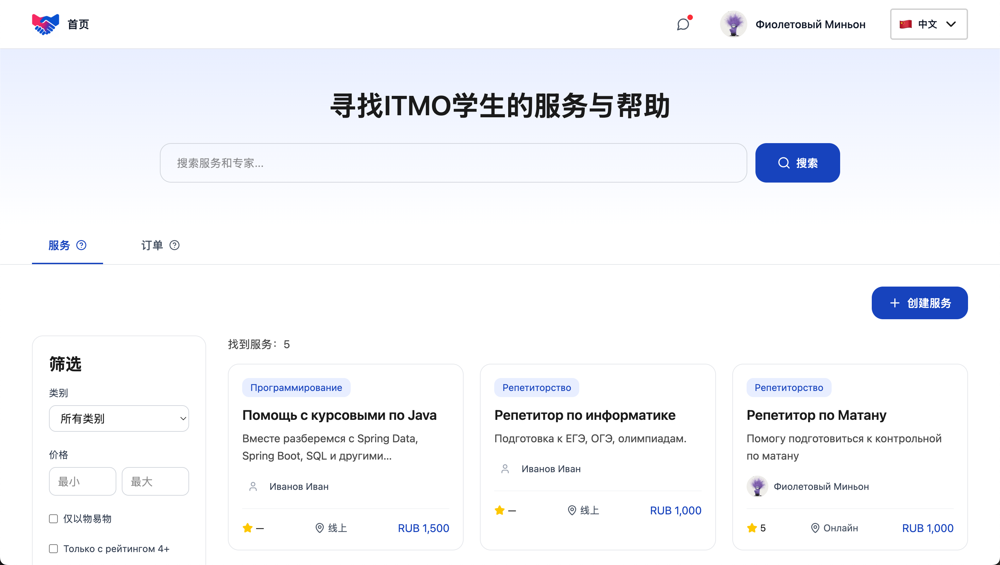

### Панель администратора

Управление пользователями:
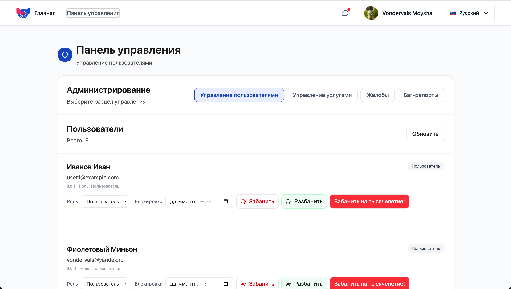

Управление услугами:
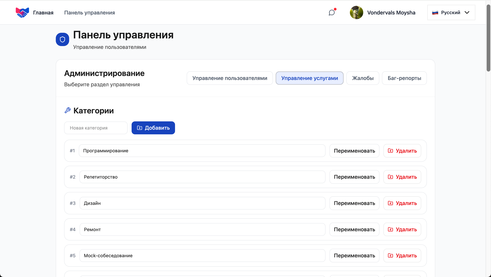
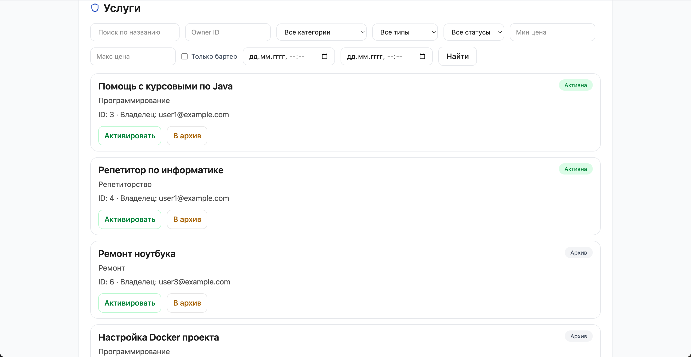

Жалобы пользователей:
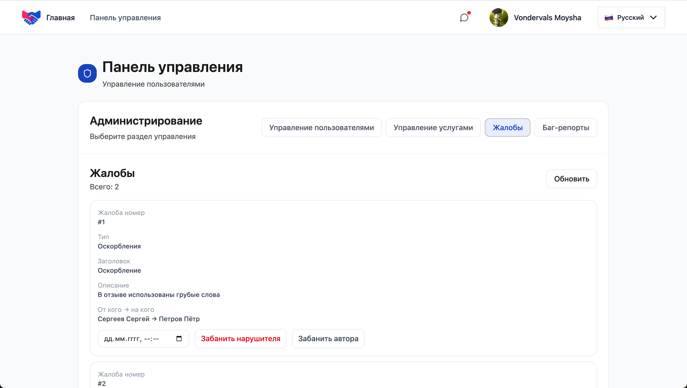

Багрепорты:
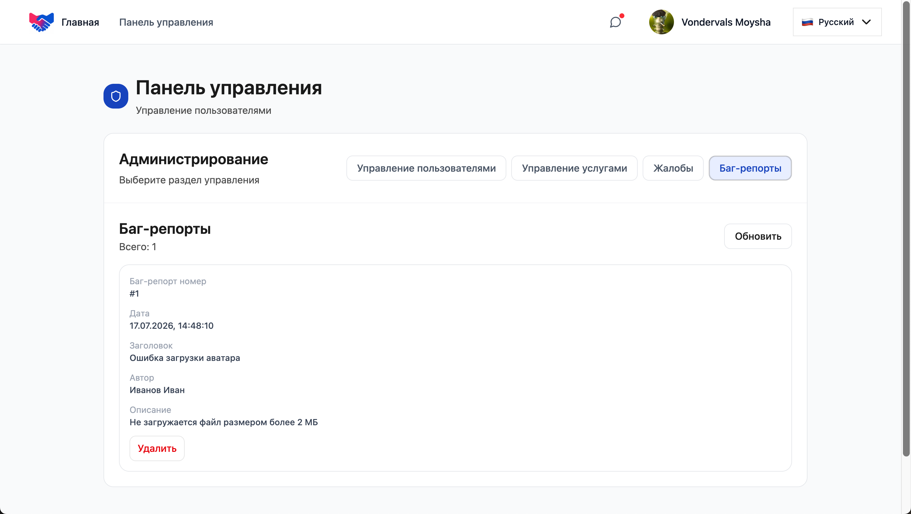

## Документация

Проектная документация (ER-модели, диаграммы классов, этапы разработки)
находится в каталоге [`docs/`](docs/).
